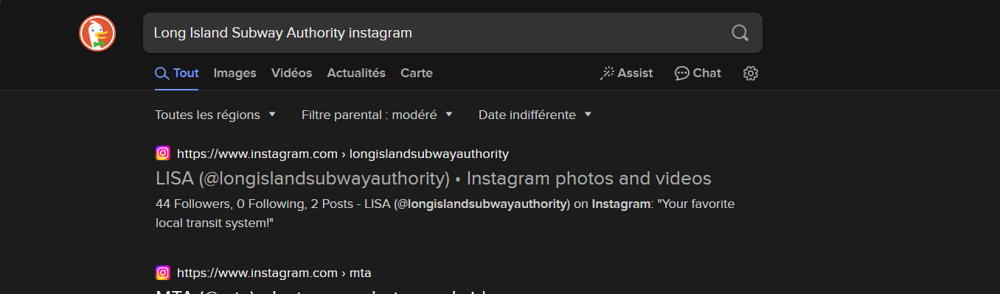
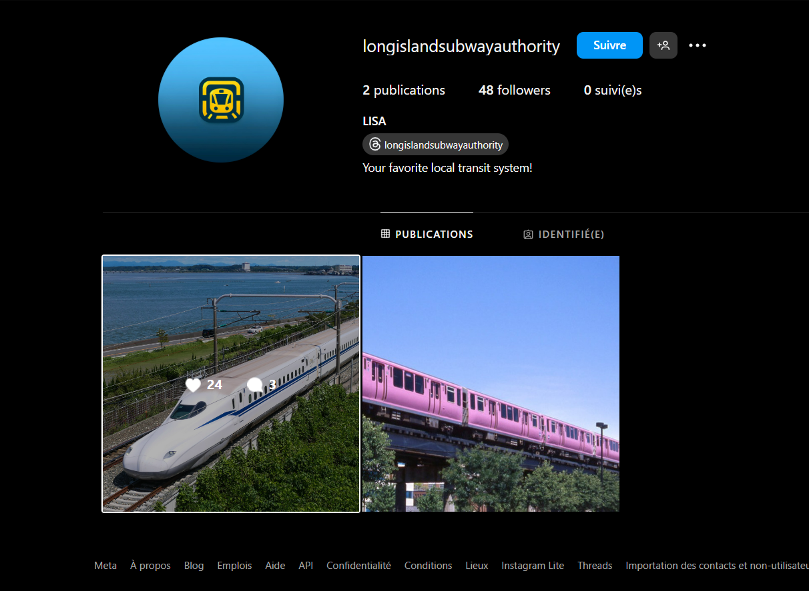
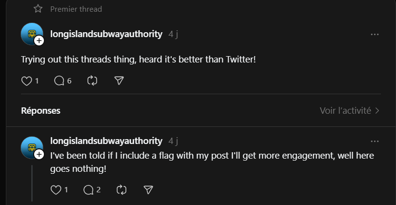
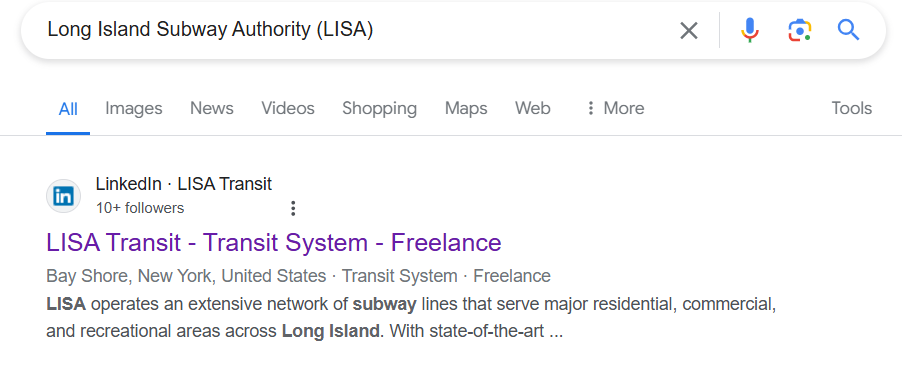
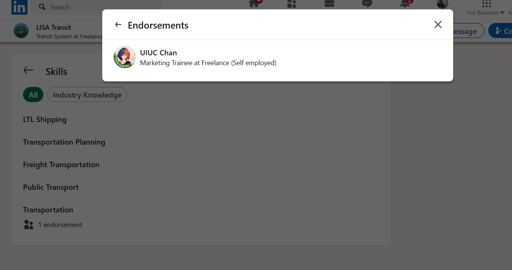
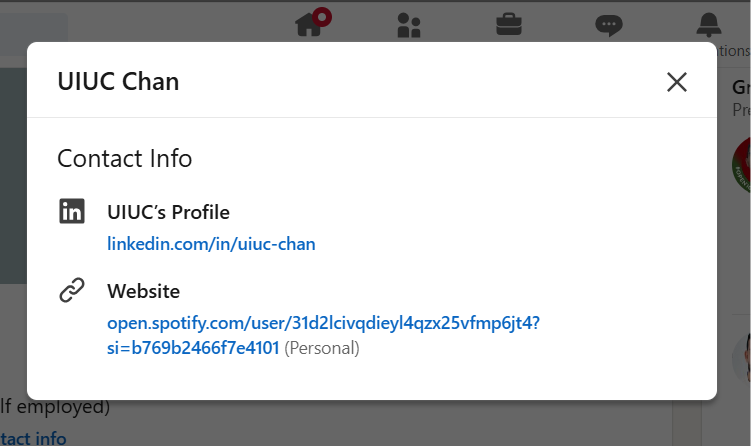
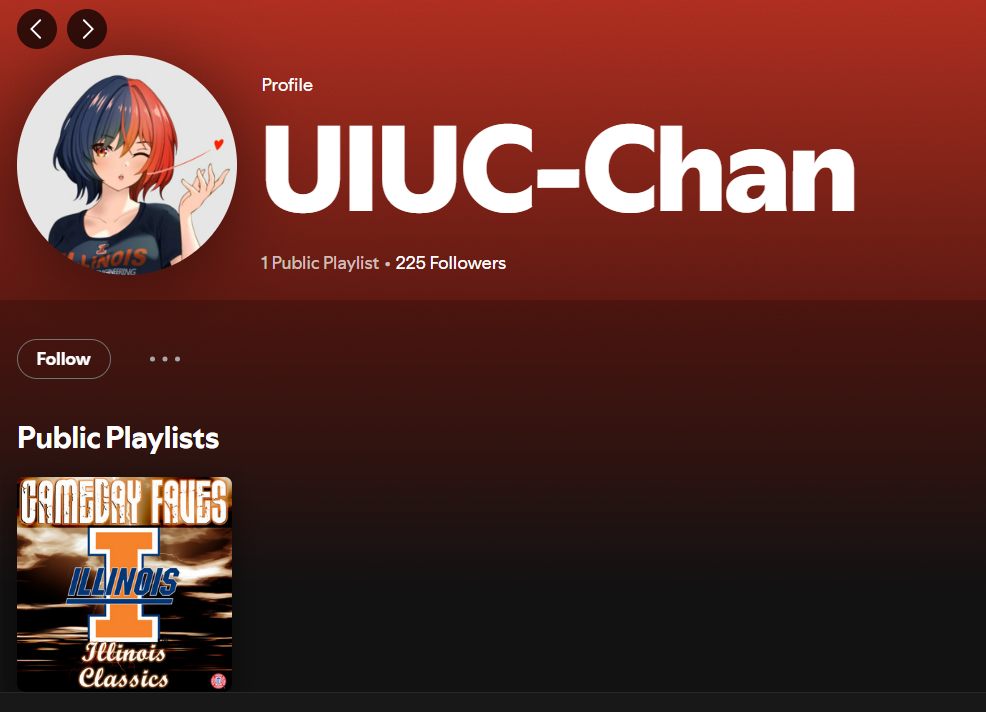
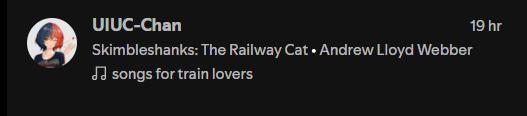

<p align="center">

<center><h1>UIUCTF2024</h1></center>
</p>

# UIUC-Chan challenge suite (OSINT)

## Table of Contents

- [Hip With the Youth [89]](#hip-with-the-youth-89)
- [An Unlikely Partnership [100]](#an-unlikely-partnership-100)
- [The Weakest Link [393]](#the-weakest-link-393)

## <a id="hip-with-the-youth-89"></a> Hip With the Youth [89]
```
The Long Island Subway Authority (LISA), in an attempt to appeal to the younger generations, has begun experimenting with social media! See if you can find a way to a flag through their Instagram.

This is part one of a three-part OSINT suite including Hip With the Youth, An Unlikely Partnership, and The Weakest Link. I recommend starting here!
```

## Steps Taken

The first challenge supposed to be the first to be solved. However, it was the last one i solved, I did not succeed in finding the Instagram account of LISA by searching in google, so i tried to switch the search engine to duckduckgo, and the first result appear to be LISA ig account.


|  | 
|:--:| 
| *Instagram account of LISA* |

after invistigating the account. 2 posts, 3 comments, 48 followers (atm), no flag yet.

|  | 
|:--:| 
| *Posts on LISA's Instagram* |

afterwards, I noticed that there is a mentionned Threads account, I checked it out and the flag is in the comment section of the very first thread.

|  | 
|:--:| 
| *Threads account of LISA* |

#### ```first flag```

> uiuctf{7W1773r_K!113r_321879}


## <a id="an-unlikely-partnership-100"></a> An Unlikely Partnership [100]

```
It appears that the Long Island Subway Authority (LISA) has made a strategic business partnership with a surprise influencer! See if you can figure out who.

This is part two of a three-part OSINT suite including Hip With the Youth, An Unlikely Partnership, and The Weakest Link. This challenge is possible without Hip With the Youth but will be easier if you start there.
```

## Steps Taken

I actually managed to solve this challenge before the first one by googling(yea i stumbled on the LinkedIn account before ig), but later on when i solved <a href="#hip-with-the-youth-89">Hip With the Youth</a> i found a lead to it in the Threads account of LISA(link to LinkedIn in bio)

|  | 
|:--:| 
| *LinkedIn account of LISA* |

For this challenge we have to find the counterpart of partnership made by LISA as the description of the challenge says, by invistigating LISA Transit LinkedIn account, i came across this endorsement by UIUC Chan


|  | 
|:--:| 
| *Endorsement by UIUC Chan* |

and the flag is found in the about section of her linkedIn account

#### ```second flag```

> uiuctf{0M160D_U1UCCH4N_15_MY_F4V0r173_129301}


## <a id="the-weakest-link-393"></a> The Weakest Link [393]

```
LISA and the secret business partner have a secret Spotify collaboration planned together. Unfortunately, neither of them have the opsec to keep it private. See if you can figure out what it is!

This is part three of a three-part OSINT suite including Hip With the Youth, An Unlikely Partnership, and The Weakest Link. I recommend starting with the other two challenges!

```

## Steps Taken

The starting point for this challenge is the LinkedIn account(obviously hehe), after checking everything in the profile, i noticed that there is a mentionned Spotify user profile in the Contact Info section.

|  | 
|:--:| 
| *Spotify profile in LinkedIn Contact Info* |

The Spotify profile looks empty with one public playlist which contains normal stuff, I looked all over the followers, nothing intersting.


|  | 
|:--:| 
| *Spotify profile with one public playlist* |

The trick here is to follow UIUC Chan on Spotify and by looking into her activity in the Friend Activity bar, I remarked that she's listening to a song on a playlist called ```songs for train lovers```, i visited the playlist which is made by LISA and UIUC Chan, and the flag can be seen in the description.


|  | 
|:--:| 
| *UIUC Chan's Spotify activity* |

#### ```third flag```

> uiuctf{7rU1Y_50N65_0F_7H3_5UMM3r_432013}
