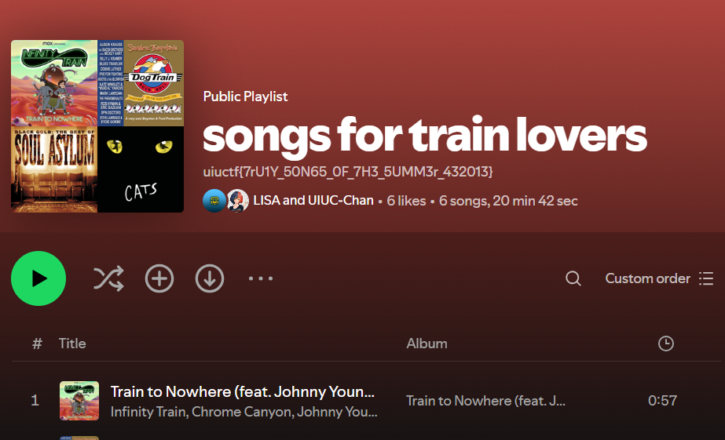

<div class="header">
    
    <h1>UIUCTF2024</h1>
</div>

# UIUC-Chan challenge suite (OSINT)

## Table of Contents

- [Hip With the Youth [89]](#hip-with-the-youth-89)
- [An Unlikely Partnership [100]](#an-unlikely-partnership-100)
- [The Weakest Link [393]](#the-weakest-link-393)

## <a id="hip-with-the-youth-89"></a> Hip With the Youth [89]
```
The Long Island Subway Authority (LISA), in an attempt to appeal to the younger generations, has begun experimenting with social media! See if you can find a way to a flag through their Instagram.

This is part one of a three-part OSINT suite including Hip With the Youth, An Unlikely Partnership, and The Weakest Link. I recommend starting here!
```

## Steps Taken

The first challenge was kinda the easiest one, and somehow was the last one i solved, I did not succeed in finding the Instagram account of LISA by searching in google, so i tried to switch the search engine to duckduckgo, and the first result appear to be LISA ig account.

<div style="text-align: center;">
    <figure>
        
        <figcaption>Instagram account of LISA</figcaption>
    </figure>
</div>

after invistigating the account I found 2 posts, i checked the comments, the users commenting. nothing intersting.

<div style="text-align: center;">
    <figure>
        
        <figcaption>Posts on LISA's Instagram</figcaption>
    </figure>
</div>

after that I noticed that there is a mentionned Threads account, I checked it out and the flag is in the comment section of the very first thread.

<div style="text-align: center;">
    <figure>
        
        <figcaption>Threads account of LISA</figcaption>
    </figure>
</div>

#### ```first flag```
<p class="hidden-text">
    uiuctf{7W1773r_K!113r_321879}
</p>

## <a id="an-unlikely-partnership-100"></a> An Unlikely Partnership [100]

```
It appears that the Long Island Subway Authority (LISA) has made a strategic business partnership with a surprise influencer! See if you can figure out who.

This is part two of a three-part OSINT suite including Hip With the Youth, An Unlikely Partnership, and The Weakest Link. This challenge is possible without Hip With the Youth but will be easier if you start there.
```

## Steps Taken

I actually managed to solve this challenge before the first one by googling(yea i stumbled on the LinkedIn account before ig), but later on when i solved <a href="#hip-with-the-youth-89">Hip With the Youth</a> i found a lead to it in the Threads account of LISA(link to LinkedIn in bio)

<div style="text-align: center;">
    <figure>
        
        <figcaption style="font-size: 12px;">LinkedIn account found by searching</figcaption>
    </figure>
</div>

So the challenge is to find the influencer with whom LISA made a partnership, by invistigating he linkedIn account, i came across this endorsement by UIUC Chan

<div style="text-align: center;">
    <figure>
        
        <figcaption>Endorsement by UIUC Chan</figcaption>
    </figure>
</div>

and the flag is found in the about section of her linkedIn account

#### ```second flag```
<p class="hidden-text">
        uiuctf{0M160D_U1UCCH4N_15_MY_F4V0r173_129301}
</p>

## <a id="the-weakest-link-393"></a> The Weakest Link [393]

```
LISA and the secret business partner have a secret Spotify collaboration planned together. Unfortunately, neither of them have the opsec to keep it private. See if you can figure out what it is!

This is part three of a three-part OSINT suite including Hip With the Youth, An Unlikely Partnership, and The Weakest Link. I recommend starting with the other two challenges!

```

## Steps Taken

The starting point for this challenge is the LinkedIn account(obviously hehe), after checking everything in the profile, i noticed that there is a mentionned Spotify user profile in the Contact Info section.

<div style="text-align: center;">
    <figure>
        
        <figcaption>Spotify user profile in LinkedIn Contact Info</figcaption>
    </figure>
</div>

The Spotify profile looks empty with one public playlist which contains normal stuff, I looked all over the followers, nothing intersting.

<div style="text-align: center;">
    <figure>
        
        <figcaption>Spotify profile with one public playlist</figcaption>
    </figure>
</div>

The trick here is to follow UIUC Chan on spotify and look into her activity in the Friend Activity bar, I found that she's listening to a song on a playlist called ```songs for train lovers```, i visited the playlist which is made by LISA and UIUC Chan, and the flag is in the description.

<div style="text-align: center;">
    <figure>
        
        <figcaption>UIUC Chan's Spotify activity</figcaption>
    </figure>
    <figure>
        
        <figcaption>The secret spotify playlist</figcaption>
    </figure>
</div>

#### ```third flag```
<p class="hidden-text">
    uiuctf{7rU1Y_50N65_0F_7H3_5UMM3r_432013}
</p>

<style>
.hidden-text {
    color: black;
    background-color: black;
    transition: color 0.3s ease;
}

.hidden-text:hover {
    color: white;
}

.header {
    display: flex;
    align-items: center;
    justify-content: center;
    margin-bottom: 50px;
}

.header img {
    margin-right: 10px;
    width: 50px; /* Adjust the width as needed */
    height: auto;
}
</style>


